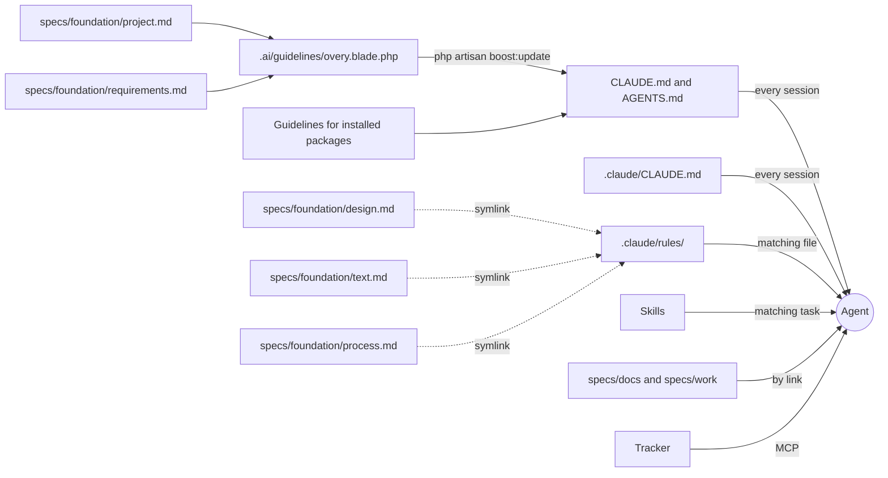

# AI-native Laravel

This repository shows how a Laravel project keeps the knowledge its AI agents work from, and how that knowledge reaches Claude Code, Cursor and Codex. It is the knowledge layer of [Overy](https://overy.app), a local-first second brain built on Laravel 13, Inertia and Svelte, with the application taken out. There is no code and nothing to install here, only the documents and the config files that connect them.

Overy keeps these files in Russian. Here they are translated into English. The snapshot was taken on 3 October 2026. Large files are cut down to excerpts, and each excerpt says so at the top.

> I’m [Nick](https://nickture.com), a product and interface designer with almost thirty years of experience. I consult teams on product, interface and conversion, record video reviews of products, teach managers to tell a good interface from a bad one, and build products with my team from idea to launch. If you need any of this, [contact me](mailto:hey@nickture.com).

## What’s inside

```
ai-native-laravel/
├── CLAUDE.md                        built by Boost: the Foundation core and the Laravel guidelines
├── AGENTS.md                        built by Boost: the same text for Cursor and Codex
├── composer.json                    excerpt: the packages Boost reads, boost:update after composer update
├── boost.json                       which agents and skills Boost sets up
├── .mcp.json                        the Boost MCP server for Claude Code
├── .ai/
│   ├── guidelines/
│   │   └── overy.blade.php          pulls the Foundation core into CLAUDE.md
│   └── rules/                       code rules by path
│       ├── index.md                 which rule file covers which paths
│       ├── app.md
│       ├── js.md
│       ├── mcp.md
│       └── vault.md
├── .claude/
│   ├── CLAUDE.md                    where things are, operational rules
│   └── rules/
│       ├── design.md  → ../../specs/foundation/design.md
│       ├── text.md    → ../../specs/foundation/text.md
│       └── process.md → ../../specs/foundation/process.md
└── specs/
    ├── foundation/                  why the product exists and which rules it follows
    │   ├── project.md               mission, principles, how project knowledge is organized
    │   ├── requirements.md          stack, invariants, code conventions
    │   ├── design.md                design system decisions
    │   ├── text.md                  readers, tone, vocabulary
    │   └── process.md               how work goes from an idea to the main branch
    ├── docs/                        how it is built
    │   ├── node-invariants.md
    │   └── product-architecture.md  excerpt
    ├── work/                        what is in progress
    │   ├── roadmap.md               open phases
    │   ├── observations.md          debt registry, excerpt
    │   └── plans/
    │       └── mcp-control-plane-execution.md
    └── archive/
        └── plans/                   finished plans
            ├── specs-layout-foundation-execution.md
            ├── graph-view-execution.md
            ├── board-grouped-list-execution.md
            └── instance-icon-inheritance-execution.md
```

`CLAUDE.md` and `AGENTS.md` are generated by [Laravel Boost](https://github.com/laravel/boost) and are never edited by hand. The code rules in `.ai/rules/` are recorded through Boost when the owner asks the agent to remember a rule. Everything else is written by people together with the agent. The three files in `.claude/rules/` are symlinks.

## How it reaches the agent

The agent pays for its context on every request, so only the core goes into every session. Everything else loads when the work touches it.

| Layer | Files | When the agent reads it |
| --- | --- | --- |
| Core | [`project.md`](specs/foundation/project.md) and [`requirements.md`](specs/foundation/requirements.md), inside `CLAUDE.md` | Every session |
| Project notes | [`.claude/CLAUDE.md`](.claude/CLAUDE.md) | Every session in Claude Code |
| Design, text and process | [`design.md`](specs/foundation/design.md), [`text.md`](specs/foundation/text.md), [`process.md`](specs/foundation/process.md) | Claude Code loads them when the agent reads or edits a matching file: the interface, a text, a plan. Other agents follow the links in `project.md` |
| Code rules | [`.ai/rules/`](.ai/rules/index.md) | Before editing a file whose path is in `index.md`. The Boost guidelines in `CLAUDE.md` tell the agent to check |
| Skills | Boost skills, [nickture skills](https://github.com/nickture/skills) | Boost skills when the task matches a skill’s description. nickture skills on every change to the interface or to a text |
| Docs and work | [`specs/docs/`](specs/docs/), [`specs/work/`](specs/work/) | When a document links to them |
| Tracker | Ideas, tasks, questions to the owner | Through MCP |
| Archive | [`specs/archive/`](specs/archive/) | Only when asked |



Which layer owns what, which one wins in a conflict and how a plan moves to the archive is written in [`project.md`](specs/foundation/project.md), in the section on how project knowledge is organized.

## How Boost builds CLAUDE.md

Boost writes `CLAUDE.md` for Claude Code and `AGENTS.md` for Cursor and Codex. It reads the packages in `composer.json` and `package.json` and adds a section of guidelines for each package it knows: Inertia, Octane, Wayfinder, Pest and others. It also adds every file from `.ai/guidelines/`. [`composer.json`](composer.json) runs `php artisan boost:update` after every `composer update`, so the guidelines follow the packages.

Boost owns only the `<laravel-boost-guidelines>` block and rebuilds it on every update. Text outside the block survives. This is why the Foundation is not written into `CLAUDE.md` directly. It lives in `specs/foundation/`, and one Blade file pulls it in:

```blade
{{-- Keep this file's name unique: a name that matches a Boost core guideline (foundation, boost, php, ...) replaces that guideline instead of adding to it. --}}
{!! file_get_contents(base_path('specs/foundation/project.md')) !!}

{!! file_get_contents(base_path('specs/foundation/requirements.md')) !!}
```

The result is the first section of `CLAUDE.md`, `=== .ai/overy rules ===`. It is both files, word for word.

- **The file name must not match a Boost guideline.** The first version was called `foundation.blade.php`. Boost has its own guideline named `foundation`, and a custom file with the same name replaces it. Twenty-one lines of Boost’s rules disappeared from `CLAUDE.md` without a warning.
- **`@include` does not work here.** Boost replaces it with a placeholder when it renders guidelines. `file_get_contents` inserts the file as it is.
- **After editing the core, run `php artisan boost:update`.** Otherwise `CLAUDE.md` and `AGENTS.md` keep the old copy.

Here `CLAUDE.md` is 34 KB, and the Foundation core takes 21 KB of it. The core holds only what the agent needs in every task: the mission, principles, stack, invariants and conventions. A description of how something is built goes to `specs/docs/`.

## Design, text and process load by topic

`design.md` and `text.md` matter only when the agent works on the interface or on words, and `process.md` when it plans or records work. Each file starts with a `paths:` list. This is the one in `design.md`; `process.md` lists `specs/work/**`:

```yaml
---
paths:
  - "resources/css/**"
  - "resources/js/**/*.svelte"
  - "resources/views/**"
---
```

`.claude/rules/` holds a symlink to each file. Claude Code scans that folder when a session starts and loads a rule when the agent reads or edits a file that matches its `paths:`. A new rule takes effect in the next session. Cursor and Codex don’t read `.claude/rules/` and find these files through the table in `project.md`.

The files stay in `specs/foundation/`, so the whole Foundation sits in one folder. The symlinks only tell Claude Code when to load them.

## Skills

Two kinds of skills work in this project.

**Boost skills.** [`boost.json`](boost.json) lists them, and Boost copies them into `.claude/skills/` and `.cursor/skills/`. They are generated, so this repository leaves them out:

```
.claude/skills/
├── fortify-development/
├── inertia-svelte-development/
├── infer-conventions/
├── laravel-best-practices/
├── mcp-development/
├── octane-development/
├── socialite-development/
├── tailwindcss-development/
├── testing-best-practices/
└── wayfinder-development/
```

**[nickture skills](https://github.com/nickture/skills).** They are the default rules for the interface and for text. `nickture-interface` covers layout, styles, components, states, accessibility and motion. `nickture-text-ru` covers Russian text, and an English version is planned. The agent reads the skill on every change to the interface or to a text and checks the finished work against it. `design.md` and `text.md` say this in their first lines: the rules of the skill apply unless the file says otherwise. `design.md` itself answers the questions from the “What to define” section of `nickture-interface`: brand, character, color, scales, motion, browsers and so on. To install the skills:

```bash
npx skills add nickture/skills
```

**Precedence.** Where the Foundation says nothing, a skill rule applies. Where the two disagree, the Foundation wins: it is stronger than skills, `.ai/rules` and plans. When the project breaks a skill’s rule on purpose, the reason is written in the Foundation.

## Components and styles

The interface stands on two things the project doesn’t write itself: [shadcn-svelte](https://www.shadcn-svelte.com) components and [Tailwind CSS](https://tailwindcss.com) utilities. All of Overy’s own styling is built on top of them.

- **Components.** shadcn-svelte sits in `resources/js/components/ui/` as vendor code. The rule is to leave it unedited and update it through the shadcn CLI. Overy broke this rule before the rule was written, and [`observations.md`](specs/work/observations.md) lists the files to move out. Overy’s own look and behavior go into wrappers outside `ui/`, and so do its own primitives. A new primitive appears only when nothing ready exists, and the reason is written in [`design.md`, section 15](specs/foundation/design.md#15-components).
- **Styles.** Tailwind utilities on top of the design tokens in `app.css`. A component takes values only from tokens, and a missing token is added to `@theme` before it is used. The spacing step, breakpoints and the canonical form of utilities are in [section 6](specs/foundation/design.md#6-layout), the token rule is in [section 14](specs/foundation/design.md#14-tokens-before-components).

So the agent builds a new screen from existing components and tokens, and the screen looks like the rest of the product from the first version.

## How a feature goes

The whole process is in [`process.md`](specs/foundation/process.md): roles, the path from an idea to the main branch, what a plan holds, how work is shown and reviewed, and when it counts as done. In short:

1. **An idea lands in the tracker.** Overy uses its own vault, and a team may use Jira or Linear. The agent reads the tracker through MCP, asks its questions there and writes the answers back, so nothing stays only in a chat.
2. **The agent writes a plan in plan mode.** A person approves it, and it goes to `specs/work/plans/`. It has the context, the decisions, milestones, corner cases that become tests, a design review and the verification steps.
3. **The product manager or designer builds the first version in a branch.** This is design in code: the agent builds the feature in the product, with its architecture, its components and demo data, without a separate mockup. The first version may look raw. It is shown as a link or a recording, with a note on what to judge and what isn’t ready.
4. **Specialists review the branch.** The frontend developer, the backend developer and anyone whose area the change touches review it and refine the same branch, not rebuild it. It goes into the main branch when every reviewer accepts it and the checks are green.
5. **When the plan is done,** its outcome goes into `specs/docs/` or `specs/foundation/`, and the file moves to `specs/archive/plans/`.
6. **A finding that isn’t fixed right away** goes into `specs/work/observations.md` in the same pass. A closed entry is deleted from it.

Five plans show what this looks like:

| Plan | Status | What it shows |
| --- | --- | --- |
| [mcp-control-plane-execution.md](specs/work/plans/mcp-control-plane-execution.md) | Live | The MCP surface for agents, with finished and open milestones |
| [specs-layout-foundation-execution.md](specs/archive/plans/specs-layout-foundation-execution.md) | Done | How this layout and the Foundation were made |
| [graph-view-execution.md](specs/archive/plans/graph-view-execution.md) | Done | A new view: milestones, corner cases, verification, design review |
| [board-grouped-list-execution.md](specs/archive/plans/board-grouped-list-execution.md) | Done | A small feature in three milestones |
| [instance-icon-inheritance-execution.md](specs/archive/plans/instance-icon-inheritance-execution.md) | Done | A design document. The note at the top says the build later went another way |

The debt registry is [`observations.md`](specs/work/observations.md). Its section “Code diverges from Foundation” lists where the code doesn’t follow `design.md` yet.

## Start in your project

1. Work on a branch, so nothing reaches production by accident.
2. Install Boost: `composer require laravel/boost --dev`, then `php artisan boost:install`.
3. Ask the agent to write `specs/foundation/project.md` (why the product exists, its principles) and `requirements.md` (stack, invariants, conventions) from the code and from what you tell it. Keep both short: they go into every session.
4. Add `.ai/guidelines/<your-project>.blade.php` with the two `file_get_contents` lines and run `php artisan boost:update`.
5. Ask the agent to answer the “What to define” questions of `nickture-interface` from your code and screenshots and to measure the contrast of your color tokens. Write the answers to `specs/foundation/design.md` with a `paths:` list and add a symlink in `.claude/rules/`. Do the same for `text.md`.
6. In a separate pass, review the screens against the `nickture-interface` checklist. Findings go to `specs/work/observations.md`.
7. Keep vendor components, such as shadcn, unedited in their own folder. Put your own look and behavior into wrappers outside it.
8. Write `specs/foundation/process.md` for your team: who brings the first version, who reviews which part, what a plan holds, what “done” means. Overy’s file is a starting point.
9. Connect your tracker’s MCP server at user scope and take the token from an environment variable. Overy’s own server is connected like this:

   ```bash
   claude mcp add -s user --transport http overy https://overy.app/mcp/nodes \
     --header 'Authorization: Bearer ${OVERY_TOKEN}'
   ```

   User scope makes the tools available in every project. Claude Code expands `${OVERY_TOKEN}` when it connects, so the token never lands in the config file.

## Not included

- Application code, `vendor/`, `node_modules/` and lock files.
- Boost skills and `.cursor/`, which Boost generates.
- `specs/docs/dev-commands.md` (commands, environments, build traps) and `specs/docs/product-ux.md`. The Foundation still mentions them by path.
- Most of `product-architecture.md` and `observations.md`, the phase folders and the other plans.
- The agent’s memory. Claude Code keeps it outside the repository, for things the repository can’t tell.

## License

[CC BY 4.0](LICENSE). The Laravel Boost guidelines inside `CLAUDE.md` and `AGENTS.md` come from Laravel Boost and are covered by its MIT license.
